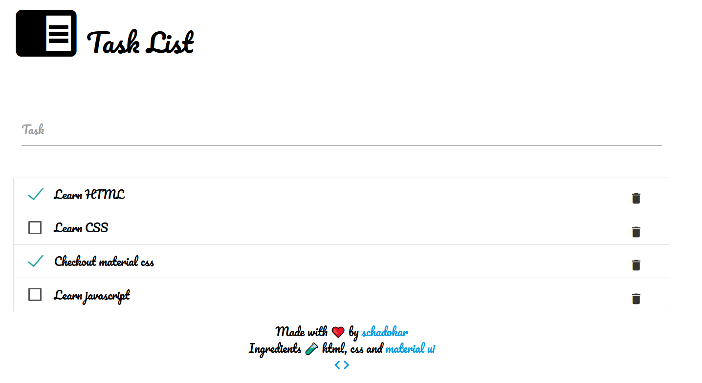

# Task List in HTML, CSS and Material CSS

This task list saves all the tasks in the browser local storage.

Tutorial is published at [blog](https://schadokar.dev/posts/create-a-task-list-in-html/).

[Demo App](https://day-to-day-coding.github.io/html-task-list/)

---
